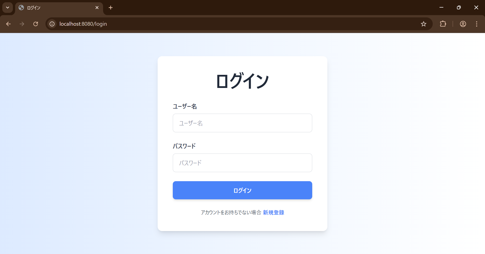
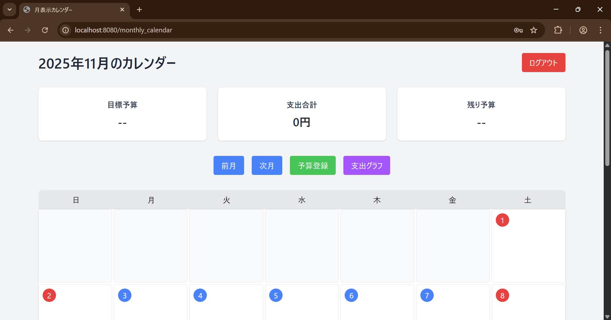
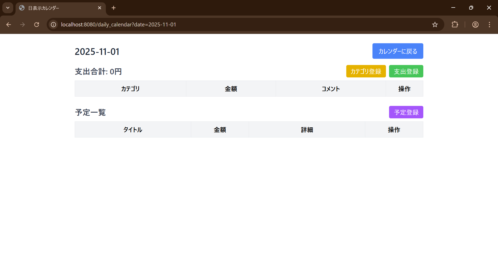

# BudgetCalendar

本アプリは、月ごとの予算管理・支出記録・予定登録をひとつにまとめて管理できる家計管理アプリです。
日々の支出はもちろん、これからの予定にかかる金額もあらかじめ予算に反映されるため、“先取り” で賢くお金を使えるのが特徴です。 
一人暮らしの方や学生、月単位でお金を把握したい社会人に向けて、シンプルな操作で直感的に家計を管理できるよう設計しています。

---

## 📌 目次

1. [はじめに](#はじめに)
2. [機能一覧](#機能一覧)
3. [画面イメージ](#画面イメージ)
4. [工夫したポイント](#工夫したポイント)
5. [使用技術](#使用技術)

---

## はじめに

このアプリは家計簿と予定表を一体化することで、節約やその促進を目的として開発しました。  
私自身、新社会人として独り暮らしを始めたばかりですが、節約の為に家計簿アプリを色々試しました。しかし、どうもしっくりくるアプリがなかった為、いっそのこと自分で作ることにしました。 
私が欲しかった本アプリの特徴としては、支出だけでなく、予算や予定の登録も出来ることにより、計画的なお金の使い方を管理出来ます。

---

## 機能一覧

- ユーザー登録
- ログイン機能
- 目標予算登録機能
- 支出登録機能
- 支出用カテゴリ登録機能
- 予定登録機能
- 残り予算表示機能(目標予算から支出・予定金額の合計を引く)
- 月ごとの支出集計表示

---

## 画面イメージ

### 📱 ホーム画面

---

### 🔐 ログイン画面

登録済みのユーザー情報を用いてログインを行う画面です。  
ユーザーごとの家計データを安全に管理できるようにしています。

---

### 📅 月表示カレンダー

1か月の予定と支出をカレンダー形式で確認できる画面です。  
各日付をクリックすることで、その日の詳細情報を確認できます。

---

### 📆 日表示カレンダー

選択した日の支出や予定を詳細に確認できる画面です。  
支出の登録や予定の確認をこの画面から行うことができます。

---

## 工夫したポイント
本アプリで最も苦労し、工夫した点はカテゴリ登録機能の実装です。

支出登録時には、支出がどのカテゴリに属するのかを選択できるようにしています。
デフォルトのカテゴリとして「食費」と「生活雑費」を用意し、それ以外の場合は「その他」を選択して内容を入力できるようにしました。

さらに、ユーザーごとによく利用するカテゴリを自由に追加できるよう、カテゴリ登録機能を実装しています。

この際に課題となったのが、「全ユーザー共通で使用するデフォルトカテゴリ」と「ユーザーごとに追加できるカテゴリ」をどのように管理するかという点でした。

解決策として、ユーザー情報を管理するデータベースに、初期状態で `master` というユーザーを登録し、そのユーザーにデフォルトカテゴリを紐付ける設計としました。  
カテゴリ表示時には `master` の `user_id` に紐づくカテゴリと、ログインユーザーの `user_id` に紐づくカテゴリの両方を取得して表示することで、共通カテゴリとユーザー固有カテゴリを同時に利用できる仕組みを実現しました。

---

## 使用技術

| カテゴリ | 技術 |
|---------|------|
| Backend | Java / Spring Boot |
| Frontend | HTML / CSS / JavaScript / Thymeleaf |
| DB | MySQL |
| Infra | GitHub |
| その他 | Lombok / MyBatis |

---

